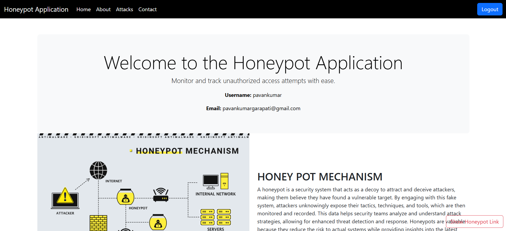
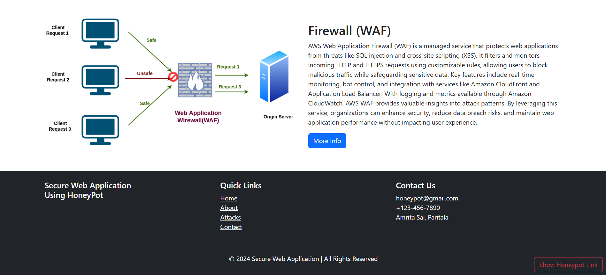
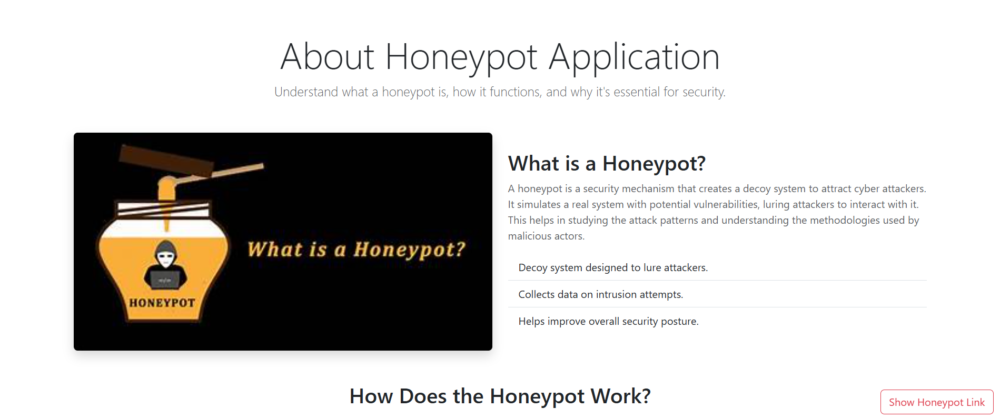
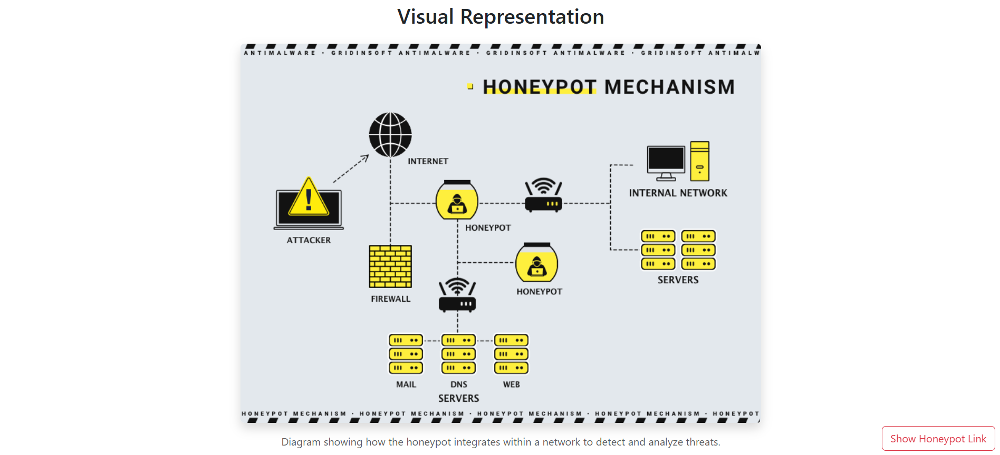
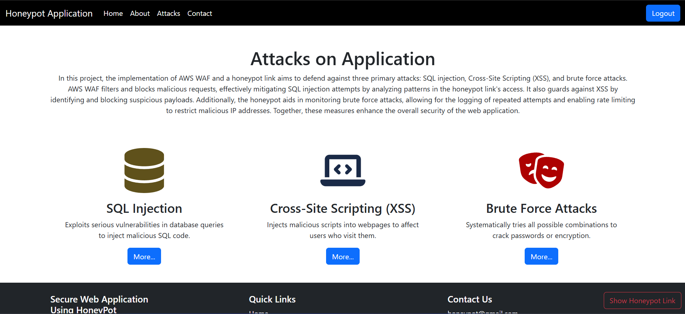
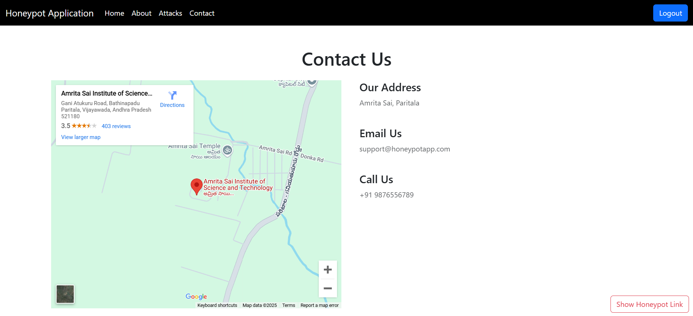
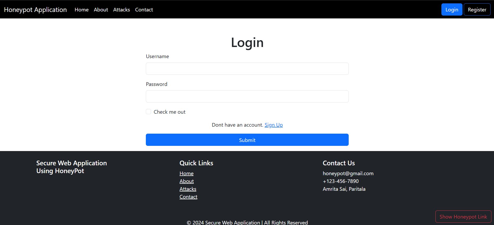
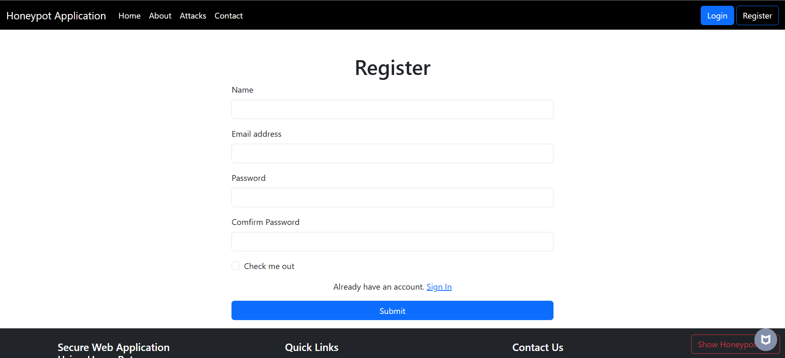
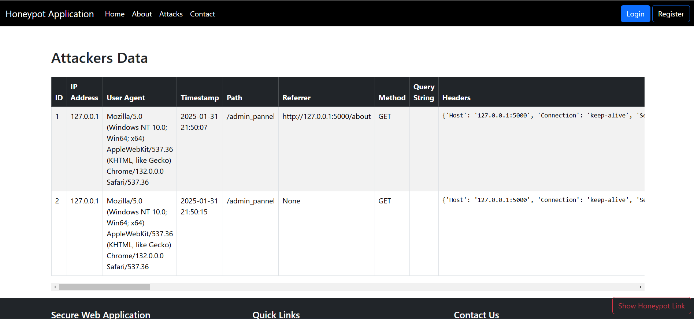

# HoneyPot Project
## Introduction
The HoneyPot Project is a web application designed to demonstrate how the concept of a honeypot works in cybersecurity. By simulating a vulnerable system, it attracts potential attackers and logs unauthorized access attempts. This project provides valuable insights into attack patterns and techniques, helping security professionals to study attacker behavior and develop better defense mechanisms.

## Features
- Attracts potential attackers
- Logs unauthorized access attempts

## Contributing
Contributions are welcome! Please fork the repository and submit a pull request.

## Project Images

### Homepage

### About Page

### Visual Representation Page

### Attacks Page

### Contact Page

### Login Page

### Register Page

### Show Attackers Data Page

## Contact
For any questions or suggestions or to get this project, please open an issue or contact the project maintainer at pavankumargarapati04@gmail.com.