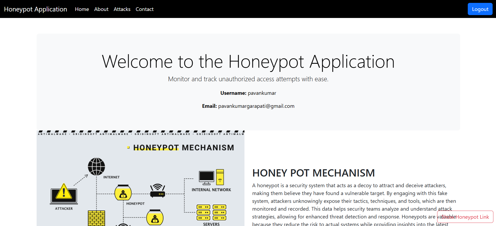
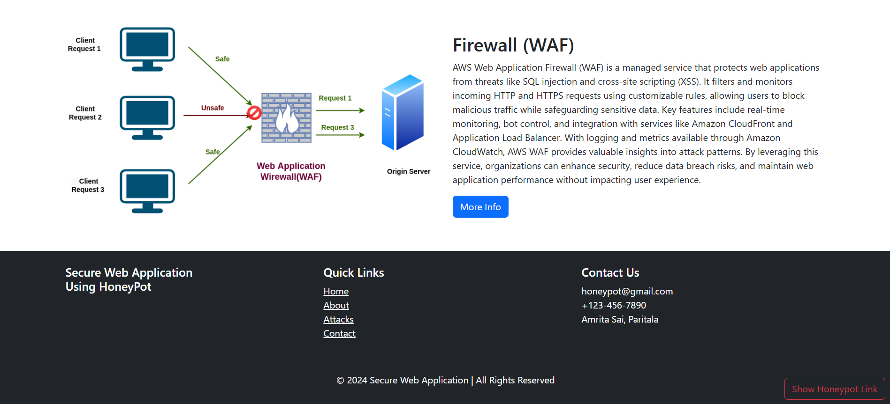
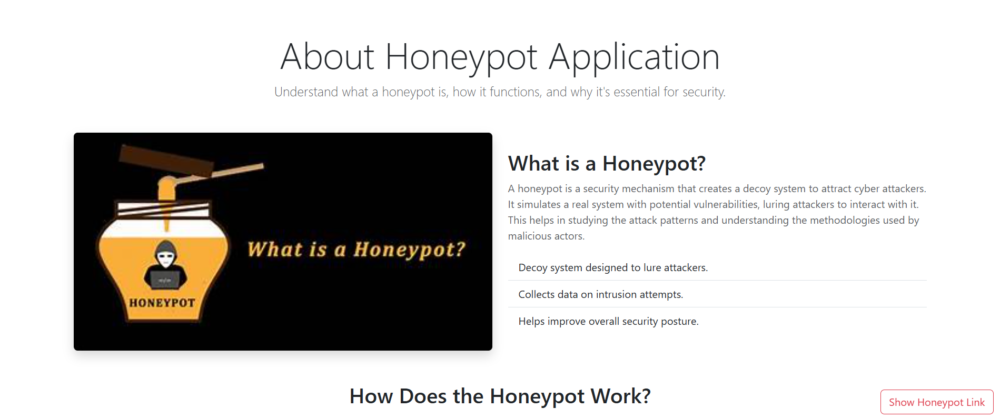
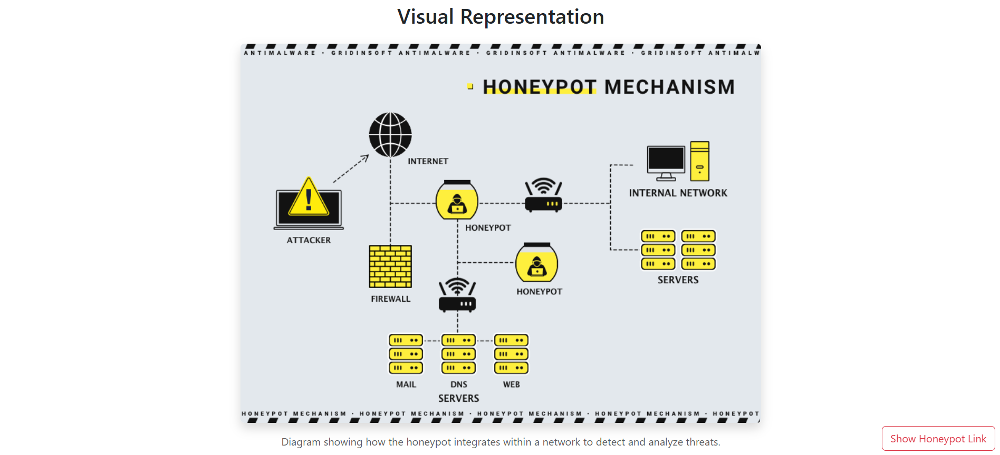
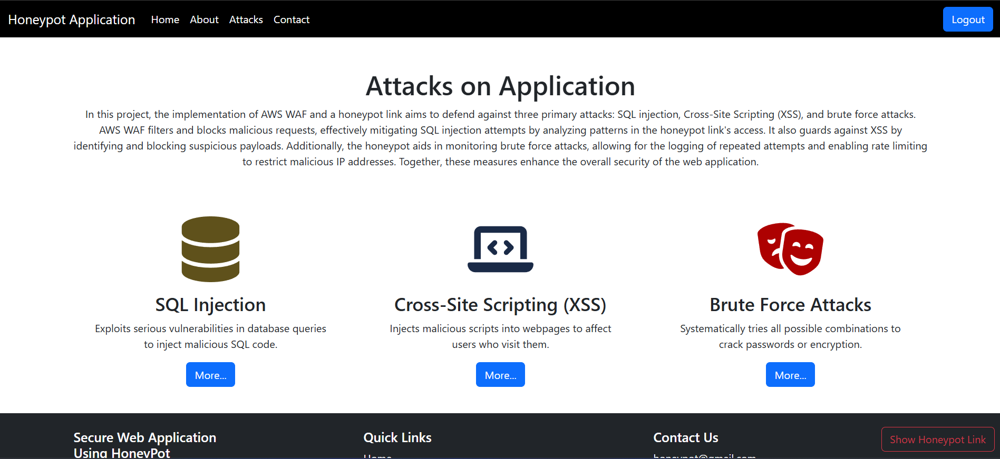
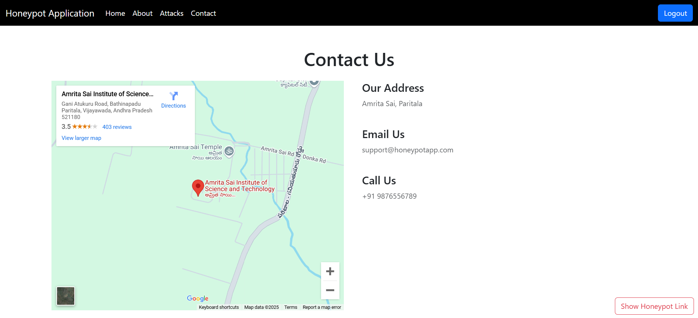
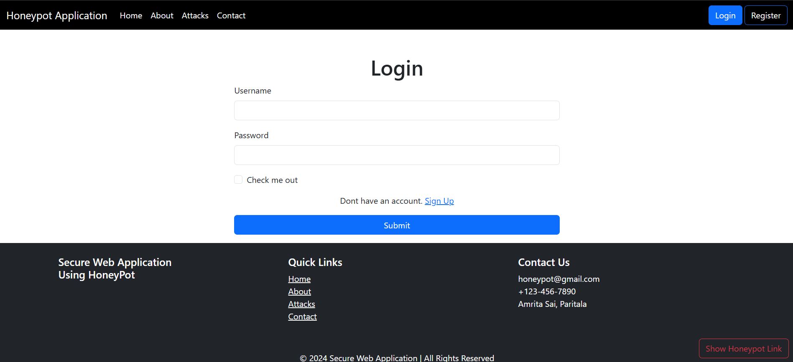
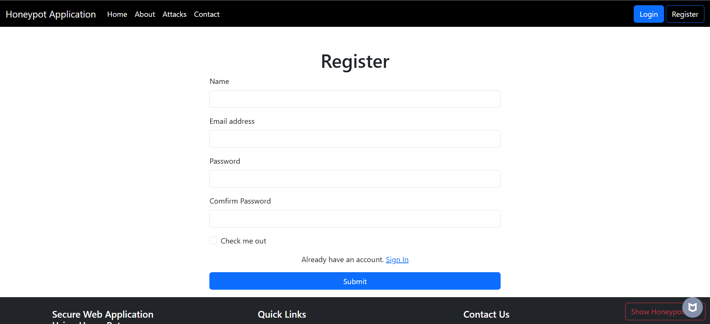
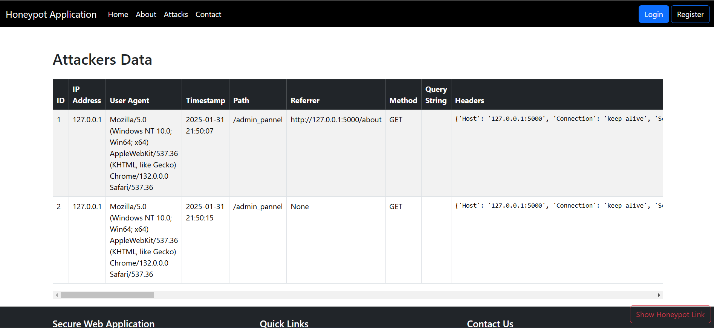

# HoneyPot Project
## Introduction
This project is a honeypot designed to detect and analyze unauthorized access attempts. It aims to improve security by attracting potential attackers and studying their behavior.

## Features
- Attracts potential attackers
- Logs unauthorized access attempts

## Contributing
Contributions are welcome! Please fork the repository and submit a pull request.

## Project Images

### Homepage

### About Page

### Visual Representation Page

### Attacks Page

### Contact Page

### Login Page

### Register Page

### Show Attackers Data Page

## Contact
For any questions or suggestions or to get this project, please open an issue or contact the project maintainer at pavankumargarapati04@gmail.com.